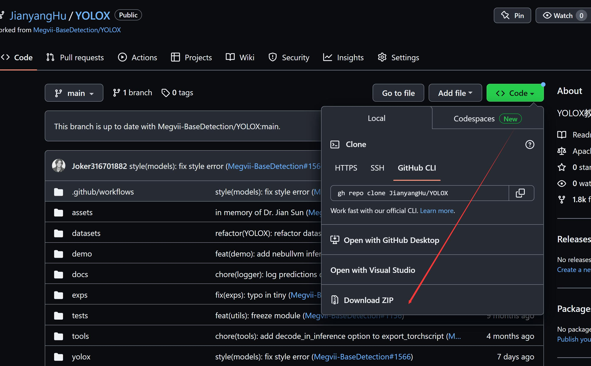
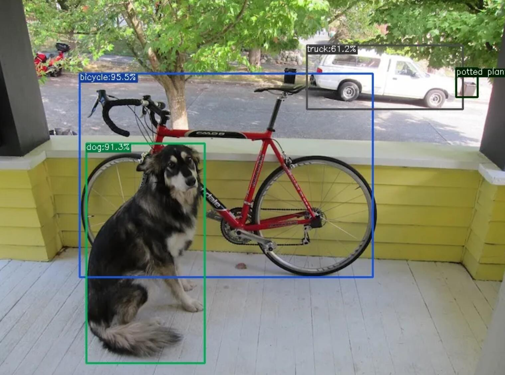
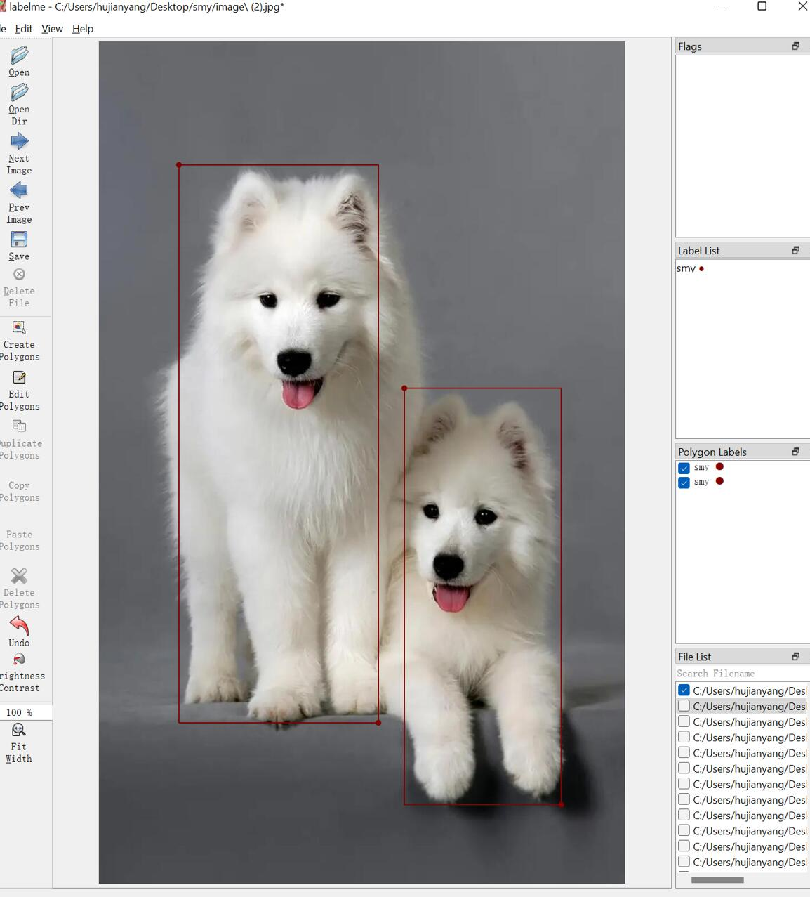
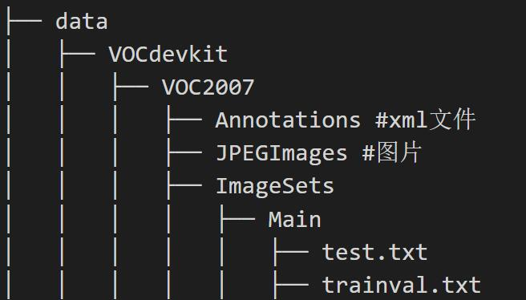
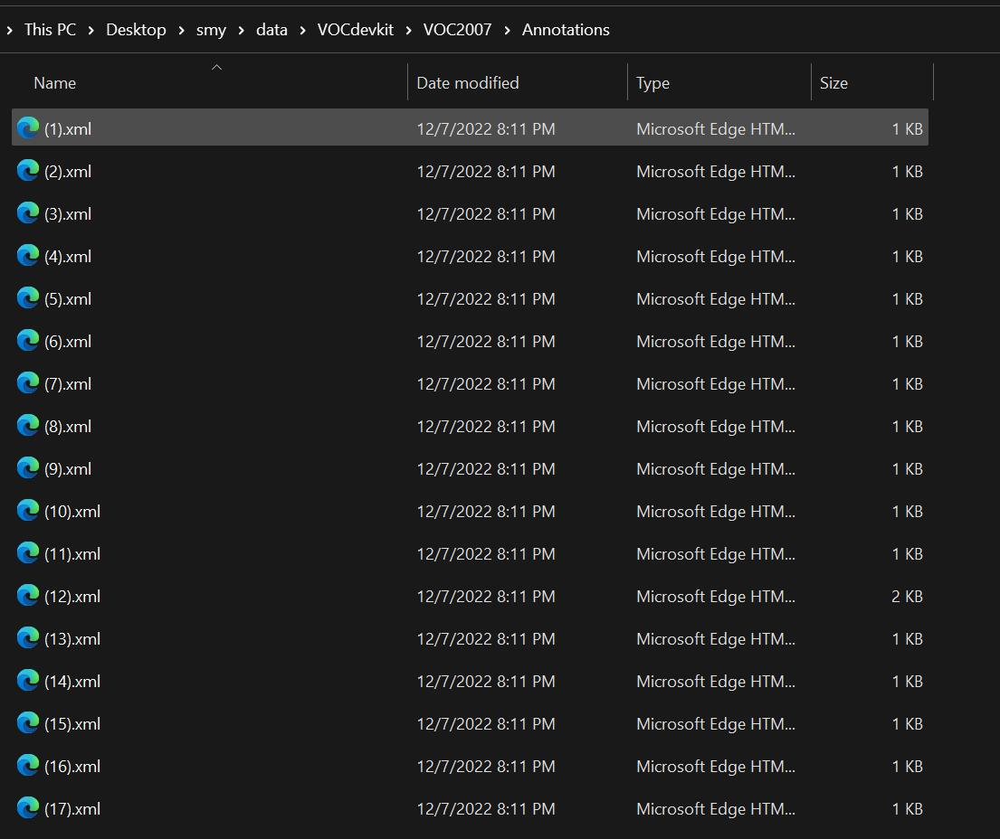

# YoloX教程
因为我是用这个YOLOX版本跑起来的，所以主要记录一下具体步骤，YOLOX效果介于YOLOv5和YOLOv7之间，也还算可以。

## 1、从git仓库里面下载YOLOX文件

## 2、然后执行下面的命令，安装所有的依赖包。
> pip install -r requirements.txt

## 3、安装YOLOX
> python setup.py install
>
注意：在安装以及后续的运行过程中，可能会提示 No module named 'xxxx’ ，这说明缺少xxxx库，可以使用清华镜像安装
>pip install -i https://pypi.tuna.tsinghua.edu.cn/simple xxxxx

## 4、通过运行自带的例子看看是YOLOX有没有装上
cd到YOLOX目录中执行
>python tools/demo.py image -f exps/default/yolox_s.py -c 
  ./yolox_s.pth --path assets/dog.jpg --conf 0.3 --nms 0.65 --tsize 
  640 --save_result --device gpu

要是出现以下结果，说明YOLOX安装无误，可以进行训练自己的数据了

## 5、使用Labelme制作数据集
Lableme是对目标进行标注的软件，可以使用pip安装
> pip install labelme

正常对图片进行标注就行了，记得图片和json保存在同一个文件夹里面

## 6、构造数据路径结构
要构建以下的路径结构，不然后续代码运行不了    

## 7、转化为YOLO需要的数据格式
然后使用labelme2voc.py文件将json格式转化为YOLO需要的xml格式

## 8、修改配置文件

文件路径：exps/example/yolox_voc/yolox_voc_s.py，将num_classes修改为类别的数量

修改完成后开始训练

## 9、开始训练

> python setup.py install 
>
> python tools/train.py -f exps/example/yolox_voc/yolox_voc_s.py -d 1 -b 4 --fp16  -c yolox_s.pth

## 10、开始预测
> python tools/demo.py image -f 
 exps/example/yolox_voc/yolox_voc_s.py -c YOLOX_outputs/yolox_voc_s/latest_ckpt.pth --path ./assets/aircraft_107.jpg --conf 0.3 --nms 0.65 --tsize 640 --save_result --device gpu

--path后可以加图片文件，也可以是图片的文件夹

> 主要的问题：  
1. 大部分的问题可能都是路径问题，仔细看看路径是否写对

